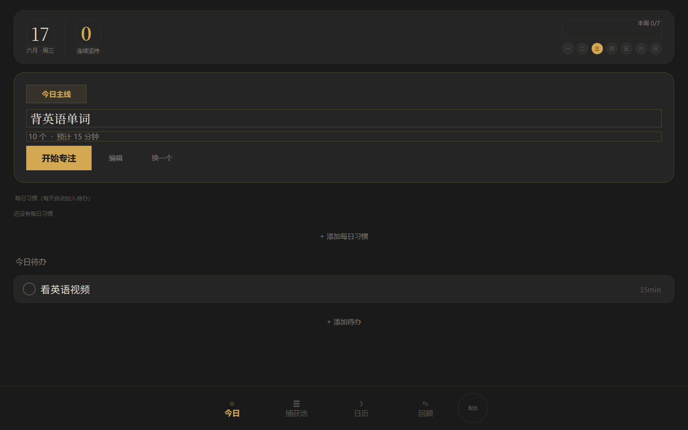
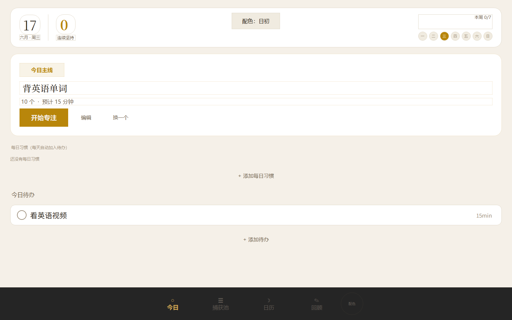

# 第一步

一个帮助你迈出每天第一步的桌面应用。温暖、极简、不压迫。

## 截图

<p align="center">
  
  &nbsp;&nbsp;
  
</p>

## 功能

- **起床助手** — 每天第一次打开时，三步小仪式帮你从床上到桌前
- **今日主线** — 每天只聚焦一件事，可调数量/时间，内置专注计时器
- **专注计时** — 圆形进度环，温和提醒不锁屏
- **今日待办** — 最多 3 件，从捕获池拖入
- **捕获池** — 三分类（待办 / 灵感 / 琐事），大脑外挂
- **每日习惯** — 设置后每天自动填入待办
- **日历 + 农历** — 月视图 + 农历干支 + 日期事项提醒
- **每日回顾** — 一句话记录，连续天数追踪
- **双主题** — 暖金（暗色）/ 日初（浅色）

## 安装运行

```bash
pip install PySide6
python app.py
```

或双击 `start.vbs` 无窗口启动。

桌面快捷方式已自动创建。

## 项目结构

```
first-step/
├── app.py          # 主程序 (PySide6 GUI)
├── data_manager.py # 数据持久化 (JSON)
├── lunar.py        # 农历计算
├── config.py       # 配置文件
├── make_icon.py    # 图标生成
├── screenshot.py   # 截图生成
├── app.ico         # 应用图标
├── start.bat       # 启动脚本
├── start.vbs       # 无窗口启动
└── data/           # 用户数据 (自动生成)
```

## 技术栈

- Python 3.12
- PySide6 (Qt for Python)
- JSON 本地存储，无网络依赖
